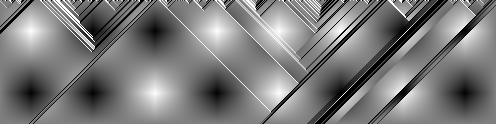

# PyWolfram

Simulator for Wolfram's automata rules.

Run `python wolfram_rules.py RULE WIDTH STEPS <RAND>`  

i.e. `python wolfram_rules.py 184 1000 150 yes`  

RULE: Wolfram rule 0-255  
WIDTH: Width of image to render in pixels (at least 18)  
STEPS: Number of generations/(height in pixels) to render (at least one)  
RAND: (Optional) Randomize starting generation  
